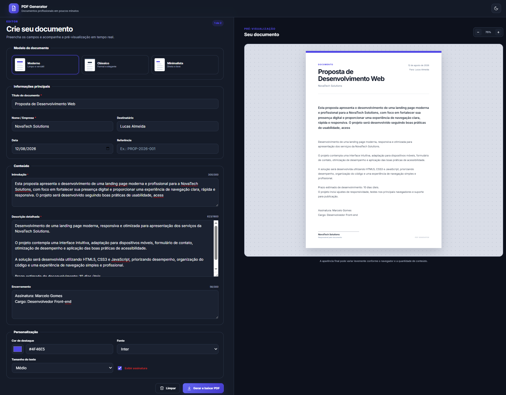

<p align="center">
  
</p>

# 📄 PDF Generator

Aplicação web para **criação de documentos profissionais diretamente no navegador**, com formulário completo, pré-visualização A4 em tempo real, modelos personalizáveis e geração de arquivos PDF.

O projeto foi desenvolvido com foco em **simplicidade, produtividade, responsividade e experiência do usuário**, utilizando HTML, CSS e JavaScript puro.


---

## 🖥️ Demonstração

### Visão geral

Interface principal do PDF Generator, reunindo formulário, configurações e pré-visualização do documento em tempo real.



### Pré-visualização do documento

Visualização do documento preenchido antes da geração do arquivo PDF.


---

## 🚀 Acessar o projeto

Você pode utilizar o PDF Generator diretamente pelo GitHub Pages:

**[Acessar PDF Generator](https://marcelogomesdev.github.io/pdf-generator/)**

> Caso o repositório utilize outro nome no GitHub, ajuste a URL do GitHub Pages de acordo com o nome utilizado.

---

## ✨ Funcionalidades

* 📝 Formulário completo para criação de documentos
* 👁️ Pré-visualização em tempo real no formato A4
* 🎨 Três modelos prontos: moderno, clássico e minimalista
* 🖌️ Personalização de cor, fonte e tamanho do texto
* ✍️ Assinatura personalizada no documento
* 📄 Geração de documentos em PDF
* ⬇️ Download do PDF diretamente pelo navegador
* ✅ Validação dos campos obrigatórios
* 🔢 Contadores de caracteres
* 💾 Salvamento automático do rascunho no LocalStorage
* 🔄 Restauração automática do último rascunho
* 🗑️ Limpeza do formulário com confirmação
* 🔍 Controle de zoom da pré-visualização
* 🔔 Mensagens de sucesso e erro
* 🌙 Modo claro e escuro
* 💻 Interface responsiva para desktop, tablet e celular
* ⌨️ Atalho `Ctrl + S` para salvar o rascunho

---

## 🛠️ Tecnologias utilizadas

| Tecnologia          | Utilização                               |
| ------------------- | ---------------------------------------- |
| **HTML5**           | Estrutura e semântica da aplicação       |
| **CSS3**            | Interface, responsividade e temas        |
| **JavaScript ES6+** | Lógica e interatividade                  |
| **LocalStorage**    | Persistência de rascunhos e preferências |
| **html2pdf.js**     | Geração e download dos documentos em PDF |

A biblioteca **html2pdf.js** é utilizada exclusivamente para transformar a pré-visualização do documento em um arquivo PDF baixável.

---

## 📂 Estrutura do projeto

```text
pdf-generator/
│
├── index.html
├── README.md
│
├── assets/
│   ├── css/
│   │   └── style.css
│   │
│   └── js/
│       └── app.js
│
└── images/
    ├── pdf-generator-home.png
    └── pdf-generator-preview.png
```

---

## ⚙️ Como executar localmente

1. Clone este repositório:

```bash
git clone https://github.com/marcelogomesdev/pdf-generator.git
```

2. Acesse a pasta do projeto:

```bash
cd pdf-generator
```

3. Abra a pasta no **Visual Studio Code**.

4. Execute o `index.html` utilizando a extensão **Live Server** ou abra o arquivo diretamente no navegador.

> É necessário manter conexão com a internet para carregar recursos externos utilizados pelo projeto, como a biblioteca responsável pela geração do PDF.

---

## 💾 Persistência de dados

O PDF Generator utiliza o **LocalStorage** do navegador para armazenar localmente:

* rascunho do documento;
* configurações selecionadas;
* preferências da interface;
* tema claro ou escuro.

Dessa forma, o usuário pode fechar ou atualizar a página sem perder automaticamente o conteúdo salvo.

---

## 🔒 Privacidade

O projeto funciona diretamente no navegador e **não possui backend próprio**.

As informações inseridas no formulário permanecem armazenadas localmente no dispositivo do usuário e não são enviadas para um servidor da aplicação.

Isso torna o projeto adequado para demonstrações, estudos e criação rápida de documentos sem necessidade de cadastro.

---

## 🌐 Publicação no GitHub Pages

Para publicar sua própria versão:

1. Envie os arquivos para um repositório no GitHub.
2. Acesse **Settings**.
3. Entre em **Pages**.
4. Em **Build and deployment**, selecione **Deploy from a branch**.
5. Selecione a branch `main`.
6. Escolha a pasta `/ (root)`.
7. Clique em **Save**.
8. Aguarde a publicação.

O GitHub disponibilizará uma URL semelhante a:

```text
https://seu-usuario.github.io/pdf-generator/
```

---

## 🎯 Objetivo do projeto

O PDF Generator foi desenvolvido como projeto de portfólio para aplicar conceitos de desenvolvimento Front-end em uma aplicação funcional, explorando:

* manipulação do DOM;
* validação de formulários;
* atualização de interface em tempo real;
* persistência de dados no navegador;
* geração de arquivos;
* responsividade;
* temas claro e escuro;
* experiência do usuário;
* organização e manutenção de código JavaScript.

---

## 📄 Licença

Este projeto está disponível para fins de **estudo e portfólio**.

Para definir permissões específicas de cópia, modificação e distribuição, consulte o arquivo de licença do repositório.

---

## 👨‍💻 Autor

**Desenvolvido por Marcelo Gomes dev**

[GitHub](https://github.com/marcelogomesdev) • [LinkedIn](https://www.linkedin.com/in/marcelogomesdev/)
